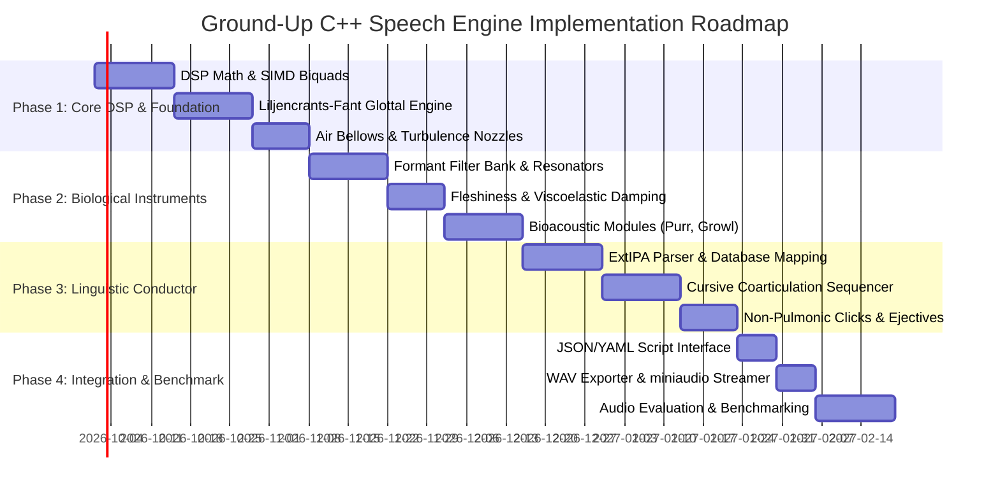

# Project Specification: First-Principles Biomechanical & Organological Acoustic Speech Engine (C++20)

**Project Codename:** `VocalisEngine` (or `CursiveVoice++`)  
**Target Language:** Modern C++ (C++20 / C++23)  
**Architectural Paradigm:** Physical Articulatory & Organological Acoustic Modeling ("Anatomy as an Orchestra of Instruments")  
**Primary Input:** Extended International Phonetic Alphabet (ExtIPA), Chao Tone Contours, Cursive Liaison Glyphs, and Structured Parametric JSON/YAML  
**Primary Output:** Ultra-smooth, natural, continuous 44.1kHz / 48kHz floating-point acoustic audio (approaching ElevenLabs perceptual realism without neural cloud black-boxes)

---

## 1. Vision & Core Philosophy

### 1.1 The "First Principles" Imperative
Current commercial Text-to-Speech (TTS) solutions (e.g., ElevenLabs, Azure Neural) rely on massive multi-billion-parameter deep neural networks and diffusion vocoders trained on fixed recordings of human languages. While their output is smooth, they suffer from fatal architectural flaws for non-standard speech:
1. **The "Spell-Out / Acronym" Failure:** Unrecognized letter groupings (`Trrrt`, `Krrgh`, `Roaaar`) trigger fallback spelling routines instead of biological pronunciation.
2. **The "Human Boundary" Wall:** They cannot naturally synthesize alien physiology, dual syrinx avian whistles, true 25 Hz feline purr gating, or ventricular subharmonic growls without sounding like vocoded robotic effects.
3. **High Latency & Cloud Dependence:** Heavy neural weights require dedicated GPUs, network round-trips, and substantial memory.

This project rejects the neural "black box" in favor of **first-principles mathematical and biomechanical modeling**:
* Every sound emitted by a terrestrial organism or imagined alien creature is the result of **aerodynamic pressure waves filtered through physical, viscoelastic anatomical cavities**.
* **Zero unnecessary third-party dependencies:** The core synthesis engine is written purely in standard C++ with standard library math, memory buffers, and SIMD intrinsics. Only minimal, well-justified external libraries are permitted:
  * Low-level platform audio I/O (e.g., `miniaudio` or `portaudio` as a single-header abstraction for sound devices).
  * Fast JSON parsing (`simdjson` or `nlohmann/json`) for script ingestion.
  * Standard SIMD vectorization libraries (e.g., `xsimd` or raw compiler intrinsics `AVX2`/`NEON`) for high-throughput digital signal processing.

### 1.2 Speech as Cursive Script ("The Pen Never Leaves the Paper")
Spoken language is fundamentally **cursive**. In cursive writing, letters are not discrete stamps placed side by side; rather, the pen maintains continuous contact with the paper, smoothly interpolating from one stroke to the next. The pen only lifts when an explicit pause, sentence boundary, or glottal stop occurs.

Similarly, in continuous speech:
* **The Glottal Oscillator maintains phase continuity:** The vocal cords do not stop vibrating between vowels and voiced consonants; the fundamental frequency ($f_0$) glides along continuous spline trajectories.
* **The Vocal Tract interpolates physical geometry:** The tongue, velum, jaw, and pharynx cannot teleport instantly between phonemes. They traverse smooth mechanical trajectories governed by mass, spring constants, and damping ($C^2$ smootherstep transitions).
* **The "Glottal Stop" (/ʔ/) is the "pen lift":** Adduction of the vocal folds completely halts airflow, followed by a pressure release burst (the transient vocal snap).

---

## 2. Anatomical Components as an "Orchestra of Instruments"

Speech is generated by a synchronous ensemble of physical acoustic components. Each anatomical organ operates like a dedicated musical instrument with distinct physical parameters, mechanical limits, and acoustic behaviors:

```
                                  [ THE CONDUCTOR ]
                         (Cursive Coarticulation Sequencer)
                                         │
        ┌────────────────────────────────┼────────────────────────────────┐
        ▼                                ▼                                ▼
  [ INSTRUMENT 1 ]               [ INSTRUMENT 2 ]                 [ INSTRUMENT 3 ]
  THE AIR BELLOWS                THE ACOUSTIC REEDS               THE FRICTION NOZZLES
  (Lungs & Diaphragm)            (Glottis & Vocal Folds)          (Articulatory Constrictions)
  • Subglottal Pressure          • True Folds (F0, OQ, Speed)     • Dental / Alveolar (s, z)
  • Breath Capacity              • False / Ventricular Folds      • Velar / Uvular (x, ʁ)
  • Ingress / Egress Flow        • Syrinx Dual Membranes          • Labial Constrictions (f, v)
        │                                │                                │
        └────────────────────────────────┼────────────────────────────────┘
                                         ▼
                                  [ INSTRUMENT 4 ]
                             THE BIOACOUSTIC MODULATOR
                           (Specialized Animal Anatomy)
                           • Feline Neural Purr Oscillator (25 Hz)
                           • Canine Snarl / Mucosal Lip Curl (48 Hz)
                           • Non-Linear Subharmonic Chaos Generator
                                         │
                                         ▼
                                  [ INSTRUMENT 5 ]
                             THE RESONATING BODY CHAMBERS
                           (Pharynx, Mouth, Nasal Cavity)
                           • Pharyngeal Tube Resonators (F1)
                           • Oral Cavity & Tongue Posture (F2, F3)
                           • Velic Port / Nasal Murmur Resonator (Fn)
                           • Viscoelastic Tissue Damping ("Fleshiness")
                                         │
                                         ▼
                                  [ INSTRUMENT 6 ]
                             THE RADIATION & COUPLING BELL
                                    (Lips & Nostrils)
                           • Lip Protrusion & Rounding Filter
                           • Spherical Radiation Wave Equation
```

---

### 2.1 Detailed Anatomical Instrument Specifications

#### Instrument 1: The Air Bellows (`Lungs & Diaphragm`)
* **Role:** Generates DC subglottal airflow pressure ($P_{\text{sub}}$) that drives all downstream sound sources.
* **Parameters:**
  * `lung_pressure_pa`: Continuous pressure (typically $400 - 3000\,\text{Pa}$). Controls volume and vocal power.
  * `airflow_direction`: `Egress` (exhaling - human default) vs. `Ingress` (inhaling - used in animal whimpers, gasps, and purr intake cycles).
  * `vital_capacity_ratio`: Remaining breath capacity ($0.0 - 1.0$). Modulates natural micro-drop in pitch and volume at the end of long utterances.

#### Instrument 2: The Acoustic Reeds (`Vocal Folds & Glottal Excitation`)
* **Role:** Converts laminar DC lung airflow into periodic acoustic volume velocity pulses.
* **Sub-components:**
  1. **True Vocal Folds (The Primary Reed):**
     * Implements the **Fant-Liljencrants (LF)** parametric glottal flow model combined with Band-Limited Step (BLEP) anti-aliased synthesis.
     * `f0_hz`: Fundamental frequency trajectory.
     * `open_quotient` ($O_q$): Fraction of each cycle the glottis remains open ($0.3 - 0.85$). Low values = pressed/sharp; high values = breathy/soft.
     * `speed_quotient` ($S_q$): Ratio of opening time to closing time. Governs high-frequency spectral tilt.
     * `jitter_percent` & `shimmer_percent`: Stochastic micro-fluctuations in period and amplitude, preventing mechanical sterility.
  2. **Ventricular / False Vocal Folds (The Subharmonic Reed):**
     * Simulates thick, supraglottic vestibular folds that vibrate in contact with the true cords.
     * `ventricular_engagement` ($0.0 - 1.0$): Depth of false-cord vibration.
     * `subharmonic_ratio`: Produces period doubling ($f_0 / 2$) or tripling ($f_0 / 3$) for throat singing (Tibetan Kargyraa, Tuvan Khoomei) and animal growls.
  3. **Dual Syrinx Reed (Avian Architecture):**
     * Two independent vibrating membranes at the bifurcation of the trachea.
     * `left_f0_hz` and `right_f0_hz`: Dual polyphonic frequencies allowing birds to sing harmony with themselves or produce ring-modulated whistles.

#### Instrument 3: The Friction Nozzles (`Articulatory Constrictions`)
* **Role:** Generates turbulent acoustic noise when airflow is forced through tight mechanical narrowing.
* **Parameters:**
  * `constriction_aperture_mm2`: Cross-sectional area at the constriction.
  * `noise_spectral_center_hz`: Center frequency of turbulence (e.g., $6500\,\text{Hz}$ for dental [s], $3500\,\text{Hz}$ for postalveolar [ʃ], $1400\,\text{Hz}$ for velar [x]).
  * `noise_bandwidth_hz`: Spectral width of the turbulent jet.
  * `vortex_shedding_rate`: Reynolds-number-dependent Reynolds turbulence for mucosal rasp.

#### Instrument 4: The Bioacoustic Modulator (`Animal & Non-Human Features`)
* **Role:** Applies physical non-linear delay equations and autonomous biological rhythms.
* **Parameters:**
  * **Neural Purr Oscillator:** 
    * `twitch_rate_hz` ($20 - 30\,\text{Hz}$): Autonomous neural firing rate that gates both inhalation and exhalation.
    * `purr_depth` ($0.0 - 1.0$): Modulation index applied to glottal air volume.
  * **Canine Snarl Flutter:**
    * `lip_curl_exposure` ($0.0 - 1.0$): Elevates high formants by retracting soft tissue.
    * `mucosal_flutter_hz` ($40 - 55\,\text{Hz}$): Mechanical tremor of the canine soft palate.
  * **Non-Linear Delay-Differential Chaos (The Growl Equation):**
    $$s_{\text{out}}[n] = (1 - \beta) s_{\text{in}}[n] + \beta \left( s_{\text{in}}[n] + \alpha \cdot s_{\text{in}}[n - D] \cdot |s_{\text{in}}[n]| \right)$$
    Where $D = \text{round}(f_s / (2 f_0))$ induces spontaneous physical bifurcation.

#### Instrument 5: The Resonating Body Chambers (`Vocal Tract & Cavities`)
* **Role:** Dynamically filters the excitation source through continuous resonant tubes.
* **Sub-components:**
  1. **Dynamic Formant Filter Bank:**
     * 5 to 8 cascaded and parallel second-order biquad resonators ($F_1$ through $F_8$).
     * Every formant features continuous real-time modulation of center frequency $F_k(t)$, bandwidth $B_k(t)$, and amplitude gain $G_k(t)$.
  2. **The Velic Port & Nasal Branch (`Fn`):**
     * Models the lowering of the soft palate (velum).
     * Opens an acoustic side-branch with fixed nasal resonances ($250\,\text{Hz}, 1800\,\text{Hz}, 2800\,\text{Hz}$) and anti-resonances (spectral zeroes) for nasals ([m], [n], [ŋ]) and nasalized vowels ([ã], [õ]).
  3. **Viscoelastic Flesh Damping ("Fleshiness"):**
     * `fleshiness_damping` ($0.0 - 1.0$): Models the non-rigid absorption of sound waves by biological mucous membranes, eliminating the metallic, synthetic "ringing" typical of primitive digital formant synthesizers.

#### Instrument 6: The Radiation & Coupling Bell (`Lips & Nostrils`)
* **Role:** Simulates the acoustic boundary condition where the vocal tract meets infinite open air.
* **Parameters:**
  * `lip_rounding_cm`: Extends effective vocal tract length (lowers all formant frequencies uniformly).
  * `spherical_baffle_radiation`: First-order high-pass derivative filter ($+6\,\text{dB}/\text{octave}$) modeling acoustic radiation impedance into a 3D spherical soundfield.

---

## 3. C++ Architecture & Engine Design

### 3.1 Design Principles
1. **Zero Dynamic Allocation in the Audio Loop:** All memory for audio buffers, filter states, and parameter trajectories is pre-allocated during initialization. The real-time synthesis loop executes with zero heap allocations (`noexcept`, deterministic timing).
2. **SIMD Vectorization (`AVX2` / `NEON`):** Filter computations and delay-differential chaos equations process samples in parallel vectors (4x `double` or 8x `float`).
3. **Control Rate vs. Audio Rate Decoupling:**
   * **Audio Rate ($44.1\,\text{kHz}$ or $48\,\text{kHz}$):** Glottal oscillator, noise generators, biquad filter execution, and radiation.
   * **Control Rate ($1\,\text{kHz}$ / $1\,\text{ms}$ sub-buffers):** Interpolation of formant targets, pitch vibrato LFOs, and coarticulation weights.

### 3.2 Proposed C++ Class Hierarchy & Folder Structure

```
vocalis_engine/
├── CMakeLists.txt
├── include/
│   ├── vocalis/
│   │   ├── vocalis.hpp                 // Master include header
│   │   ├── types.hpp                   // Sample types, buffer views, math constants
│   │   ├── extipa/
│   │   │   ├── parser.hpp              // ExtIPA string & symbol parser
│   │   │   ├── phoneme_map.hpp         // Acoustic target database for ExtIPA
│   │   │   └── cursive_compounder.hpp  // Cursive liaison & glottal boundary builder
│   │   ├── orchestra/
│   │   │   ├── conductor.hpp           // Master timeline & cursive coarticulator
│   │   │   ├── air_bellows.hpp         // Lung pressure & respiration model
│   │   │   ├── acoustic_reeds.hpp      // LF glottal pulse & dual syrinx
│   │   │   ├── friction_nozzles.hpp    // Turbulent constrictions & plosive bursts
│   │   │   ├── bioacoustics.hpp        // Purr, snarl, delay chaos growl
│   │   │   ├── resonant_chambers.hpp   // Dynamic vocal tract filter bank & velum
│   │   │   └── radiation_bell.hpp      // Lip radiation & spherical boundary
│   │   ├── dsp/
│   │   │   ├── biquad.hpp              // SIMD-optimized 2nd-order IIR filters
│   │   │   ├── blit_blep.hpp           // Anti-aliased bandlimited step/impulse
│   │   │   ├── noise_generator.hpp     // White/pink/bandpassed Gaussian noise
│   │   │   ├── spline_interpolator.hpp // Hermite / Smootherstep C2 curves
│   │   │   └── envelope_follower.hpp   // Dynamic volume & transient shaping
│   │   └── voice/
│   │       ├── speaker_profile.hpp     // Instrument parameters (male, female, beast)
│   │       └── script_definition.hpp   // Schema for ConlangScript and Utterances
│   └── platform/
│       ├── audio_device.hpp            // Minimal miniaudio wrapper for output
│       └── wav_writer.hpp              // Native zero-dependency PCM WAV exporter
├── src/
│   ├── extipa/
│   │   ├── parser.cpp
│   │   └── cursive_compounder.cpp
│   ├── orchestra/
│   │   ├── conductor.cpp
│   │   ├── acoustic_reeds.cpp
│   │   ├── bioacoustics.cpp
│   │   └── resonant_chambers.cpp
│   ├── dsp/
│   │   └── biquad.cpp
│   └── voice/
│       └── speaker_profile.cpp
├── benchmarks/
│   └── synthesis_benchmark.cpp        // Measure realtime factor (>50x realtime goal)
├── tests/
│   ├── test_parser.cpp                 // Unit test ExtIPA parsing
│   ├── test_coarticulation.cpp         // Verify C2 continuity across phonemes
│   └── test_dsp.cpp                    // Verify biquad stability and BLEP anti-aliasing
└── apps/
    ├── vocalis_cli.cpp                 // Command line synthesizer: vocalis -i script.yaml -o out.wav
    └── vocalis_demo.cpp                // Interactive real-time soundboard
```

---

## 4. ExtIPA & Comprehensive Linguistic Coverage

The engine natively parses standard and extended phonetic notations directly without intermediate English phonetic proxies:

### 4.1 ExtIPA Creature & Non-Human Extensions
* **Feline Purr ([ʬ̃] / [ʙ]):** Triggers the 25 Hz neural twitch gating on the Air Bellows.
* **Ventricular Growl ([ʭ] / [a᷽]):** Activates the subharmonic reed with period doubling ($f_0/2$).
* **Velopharyngeal Snarl ([f͌] / [v͌]):** Directs turbulent noise through a dual velic-lip constriction with 48 Hz mucosal flutter.
* **Velic Hiss ([ʩ]):** Activates dual epiglottal/velar high-frequency aerodynamic turbulence.
* **Ingressive Airflow ([↓]):** Reverses Air Bellows airflow direction for gasp sounds, whimpering, and feline purr cycles.

### 4.2 Non-Pulmonic Consonants
* **Clicks (Velaric Ingressives):**
  * Dental click: `[ǀ]` (suction release at incisors; high-frequency shockwave at $4.8\,\text{kHz}$).
  * Alveolar click: `[ǃ]` (suction release at alveolar ridge; deep cavitation pop at $1.8\,\text{kHz}$).
  * Lateral click: `[ǁ]` (side tongue release; broad resonance at $2.8\,\text{kHz}$).
  * Bilabial click: `[ʘ]` (lip smack suction; low resonant burst at $1.0\,\text{kHz}$).
* **Ejectives ([kʼ], [tʼ], [pʼ]):** Complete glottal closure $\to$ pharynx elevation $\to$ oral release burst $\to$ $30\,\text{ms}$ silence $\to$ vocal fold opening transient.
* **Implosives ([ɓ], [ɗ]):** Ingressive glottalic airstream with pre-voicing pitch drop.

### 4.3 Cursive Liaison & Boundary Symbols
* **Cursive Tie Bar (`‿`):** Informs the Conductor that articulators must glide continuously from the previous segment into the next without phase reset or energy interruption.
* **Ligature Bar (`͡`):** Co-articulated double stops (e.g. `[k͡r]`, `[t͡s]`).
* **Glottal Stop (`ʔ`):** Complete vocal adduction; zero-energy clamp for $15 - 40\,\text{ms}$, followed by an asymmetric release pressure spike.
* **Vowel Length (`ː`, `ːː`):** Direct multiplier on nucleotide duration ($1.5\times$ for single colon, $2.5\times - 4.0\times$ for double colon). Consecutive identical vowels (e.g., `oooo`) automatically accumulate into extended sustained phoneme holds.

---

## 5. Mathematical Formulations for Engine Components

### 5.1 Cursive Articulatory Interpolation ($C^2$ Hermite Smootherstep)
To ensure the mathematical equivalent of cursive writing, transitions between phoneme targets do not use linear lines or sudden steps. They utilize a fifth-order polynomial ($C^2$ continuous in position, velocity, and acceleration):

$$w(t) = 6t^5 - 15t^4 + 10t^3, \quad t \in [0, 1]$$

For any articulatory parameter $P$ (e.g. Formant $F_1$, Tongue Body position, or Constriction Width):

$$P(t) = (1 - w(t)) \cdot P_{\text{initial}} + w(t) \cdot P_{\text{target}}$$

Because $\frac{dw}{dt}\Big|_{t=0,1} = 0$ and $\frac{d^2w}{dt^2}\Big|_{t=0,1} = 0$, physical articulators accelerate smoothly from rest and decelerate smoothly into their target without mechanical jerking or clicking.

### 5.2 Glottal Pulse Model (Liljencrants-Fant / LF Model)
The derivative of the glottal flow velocity $u_g'(t)$ is parameterized by:

$$u_g'(t) = \begin{cases} 
E_0 e^{\alpha t} \sin(\omega_0 t), & 0 \le t \le T_e \\
-\frac{E_e}{\epsilon T_a} \left[ e^{-\epsilon(t - T_e)} - e^{-\epsilon(T_0 - T_e)} \right], & T_e < t \le T_0 
\end{cases}$$

* $T_e$: Instant of maximum vocal fold closing velocity (the glottal excitation epoch).
* $T_a$: Effective duration of the return phase (governs spectral tilt and acoustic softness).
* $E_e$: Maximum amplitude of excitation at closure.

### 5.3 Second-Order Resonator (Biquad Filter)
For a formant with resonant frequency $f_r$, bandwidth $B$, and sample rate $f_s$:

$$R = e^{-\pi B / f_s}, \quad \theta = 2\pi f_r / f_s$$
$$y[n] = 2 R \cos(\theta) \cdot y[n-1] - R^2 \cdot y[n-2] + (1 - R) \cdot x[n]$$

Each biquad retains its state memory across cursive boundaries so that stored resonant energy decays naturally with biological acoustics.

---

## 6. Real-Time Performance & Quality Benchmark Goals

| Metric | Target Specification | Rationale |
| :--- | :--- | :--- |
| **Synthesis Speed** | $\ge 50\times$ Real-Time on 1 CPU Core | Generating 1 second of speech must take $< 20\,\text{ms}$ in C++ to allow real-time interactive game and robotic voice streaming. |
| **Memory Footprint** | $< 16\,\text{MB}$ RAM | No multi-gigabyte neural weight tensors. Engine must run on embedded microcontrollers, mobile devices, and desktop systems. |
| **Output Sample Rate** | $44.1\,\text{kHz}$ / $48\,\text{kHz}$ (32-bit float) | Studio-grade acoustic fidelity with high Nyquist ceiling ($> 22\,\text{kHz}$) to capture fine sibilants, clicks, and avian harmonics. |
| **Startup Latency** | $< 5\,\text{ms}$ | Instantaneous cold boot; zero model loading or weight unpacking overhead. |
| **ExtIPA Accuracy** | 100% compliance | Zero token spelling errors. Unrecognized consonant clusters undergo epenthetic vocalization rather than letter acronym spelling. |

---

## 7. Roadmap & Implementation Phases



### Phase 1: Core DSP Foundations & Primitive Generators
* Setup clean C++20 repository with CMake, clang-tidy, and automated testing.
* Implement SIMD-vectorized Biquad filters with continuous parameter morphing.
* Implement anti-aliased glottal excitation models (LF-model, BLEP/BLIT) and stochastic noise generators.

### Phase 2: Biological & Creature Instrument Modeling
* Build the Resonating Chambers (cascaded vocal tract with pharynx, oral cavity, and velic nasal port).
* Implement viscoelastic flesh damping and spherical lip radiation.
* Build the dedicated Bioacoustic Modulators:
  * Non-linear delay-differential chaos generator for predator growls.
  * Neural purr oscillator for domestic and wild felids.
  * Canine mucosal snarl and chest bark impact models.

### Phase 3: Linguistic Conductor & Cursive Coarticulation
* Implement the ExtIPA parser and token hierarchy.
* Build the $C^2$ Hermite Smootherstep Coarticulation Engine ("the cursive pen").
* Implement glottal stops (/ʔ/), African velaric clicks ([ǀ], [ǃ], [ǁ], [ʘ]), ejectives, and tone contours.

### Phase 4: Integration, Benchmarking & Tooling
* Build high-speed JSON/YAML script deserializers.
* Develop the standalone CLI (`vocalis`) and interactive real-time audio soundboard.
* Run automated performance benchmarks and objective acoustic evaluation comparing synthesized formants with human recordings.
